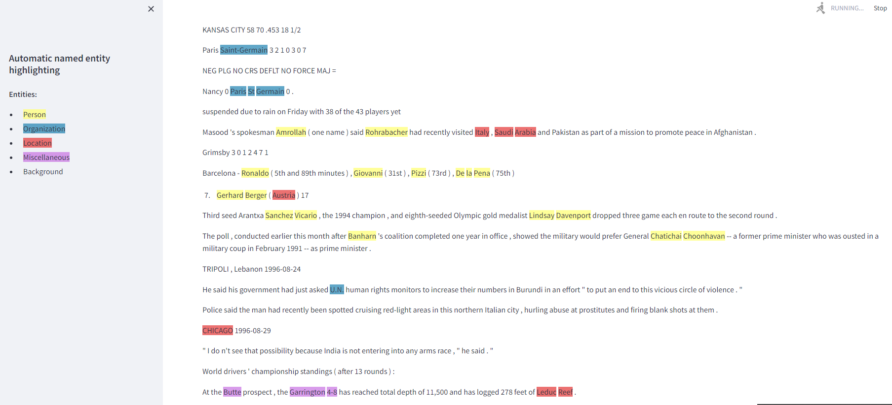

# Automatic named entity highlightind
This repository provides functionality for inference model trained for Named Entity recognition task. 
I am using "dslim/distilbert-NER" model from Huggingface and Conll2003 dataset.
## Installation
To install all dependences please run  

    pip install -r requirements.txt
To run container with image of Kafka please run  

    docker-compose up -d
## Settings
In both folder's of application (backend and frontend) you can find config.json file. 
Backend:

    {"bootstrap.servers": "localhost:9095",
    "preprocess_topic": "preprocessing",
    "inference_topic": "inference",
    
    "labels_mapping" : {"O": 0, "B-PER": 1, "I-PER": 2, "B-ORG": 3, "I-ORG": 4,
                        "B-LOC": 5, "I-LOC": 6, "B-MISC": 7, "I-MISC": 8},
    "device": "cpu",
    "data_path": "../../data/train.txt",
    "model": "dslim/distilbert-NER"
    }
Frontend:

    {"bootstrap.servers": "localhost:9095",
      "preprocess_topic": "preprocessing",
      "inference_topic": "inference",
    
      "labels_mapping" : {"O": 0, "B-PER": 1, "I-PER": 2, "B-ORG": 3, "I-ORG": 4,
                          "B-LOC": 5, "I-LOC": 6, "B-MISC": 7, "I-MISC": 8},
      "colors_mapping": {"PER": "rgba(255, 255, 128, .8)", "ORG": "rgba(30,129,176, .7)",
                         "LOC": "rgba(228,52,52, .7)", "MISC": "rgba(200, 114, 226, .7)"}
    }
You can specify all model or data related parameters. Please note that all parameters should be consistent with each other from other folders.
## Running
To run application please run

    run.sh
This script will launch all necessary scripts from both parts of application.  
If you want to stop it, please type CTRL+C in your terminal.  
If all steps was executed correctly your browser should be opened and than you will se something like that:

